## PHẦN 1. PHÂN TÍCH PROJECT

### **Câu 1: Bảng xác định file xử lý hiển thị danh sách sinh viên**

| Thành phần | File xử lý | Đường dẫn | Vai trò cụ thể |
| :--- | :--- | :--- | :--- |
| **Route** | `studentRoutes.js` | `student-management/routes/studentRoutes.js` | Tiếp nhận yêu cầu GET gửi tới `/students` |
| **Controller** | `studentController.js` | `student-management/controllers/studentController.js` | Gọi Model lấy danh sách và gửi sang View để render giao diện |
| **Model** | `studentModel.js` | `student-management/models/studentModel.js` | Thực thi SQL SELECT truy vấn danh sách từ SQLite database |
| **View** | `index.ejs` | `student-management/views/students/index.ejs` | Nhận dữ liệu sinh viên từ Controller và render ra bảng HTML |

### **Câu 2: Luồng xử lý khi truy cập GET `/students`**

1. **`app.js`**: Tiếp nhận request `/students`, chuyển tiếp yêu cầu sang `studentRoutes`.
2. **`studentRoutes.js`**: Khớp route `/` (GET) và gọi hàm `studentController.index`.
3. **`studentController.js`**: Hàm `index` lấy từ khóa tìm kiếm (nếu có), gọi model `getAllStudents` hoặc `searchStudents`.
4. **`studentModel.js`**: Truy vấn SQLite để lấy dữ liệu rồi trả kết quả (dưới dạng Promise) về cho Controller.
5. **`studentController.js`**: Nhận dữ liệu, truyền sang view và gọi `res.render("students/index")`.
6. **`index.ejs`**: Biên dịch mã EJS thành tài liệu HTML hoàn chỉnh và trả về cho trình duyệt Client.

### **Câu 3: Vai trò các thành phần trong mô hình MVC**

- **Routes**: Định tuyến đường đi cho request, kết nối URL và phương thức HTTP (GET, POST) với hàm xử lý trong Controller.
- **Controllers**: Trung tâm xử lý logic nghiệp vụ; tiếp nhận tham số đầu vào, điều phối gọi Model xử lý dữ liệu và chọn View hiển thị kết quả.
- **Models**: Trực tiếp tương tác với cơ sở dữ liệu (SQLite), thực thi các câu lệnh SQL để truy vấn/ghi/xóa dữ liệu.
- **Views**: Định nghĩa giao diện HTML và các thẻ ejs để hiển thị dữ liệu trực quan cho người dùng cuối.

---

## PHẦN 2. SỬA LỖI PROJECT

### **1. Lỗi 1: Không thể GET `/students/create` (Cannot GET /students/create)**
- **Nguyên nhân**: Nút thêm sinh viên dẫn tới `/students/create`, nhưng route GET hiển thị form trong **routes/studentRoutes.js** lại định nghĩa sai là `/add`.
- **Cách sửa**: Sửa đường dẫn route GET trong file **routes/studentRoutes.js** từ `/add` thành `/create`:
  ```javascript
  router.get("/create", studentController.createForm)
  ```
- **Minh chứng kết quả sau khi sửa**:
  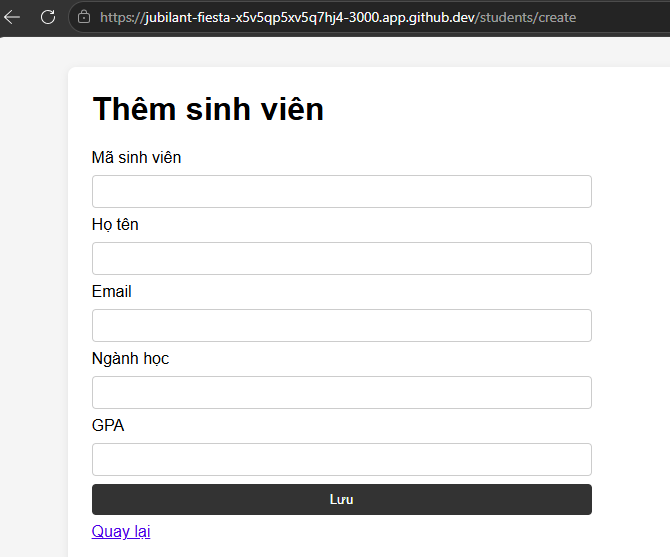

### **2. Lỗi 2: Báo lỗi không tìm thấy view (Cannot find view) sau khi submit form thêm mới**
- **Nguyên nhân**: Hàm `store` trong **controllers/studentController.js** gọi `res.render("students/list")` nhưng không có tệp view `list.ejs`. Theo nguyên tắc web, sau khi thêm dữ liệu (POST) cần redirect về trang danh sách (GET).
- **Cách sửa**: Sửa lại dòng kết quả thành chuyển hướng (redirect) về trang danh sách:
  ```javascript
  res.redirect("/students")
  ```
- **Minh chứng kết quả sau khi sửa**:
  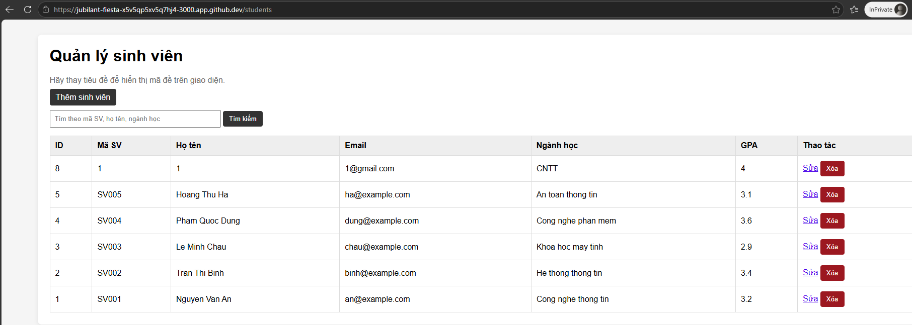

### **3. Lỗi 3: Không lọc được kết quả khi tìm kiếm**
- **Nguyên nhân**: Hàm `searchStudents(keyword)` trong **models/studentModel.js** không sử dụng tham số đầu vào `keyword` mà chỉ chạy câu lệnh SELECT lấy toàn bộ dữ liệu.
- **Cách sửa**: Cập nhật câu lệnh SQL có điều kiện lọc `WHERE ... LIKE ?` trong file **models/studentModel.js**:
  ```javascript
  const sql = `SELECT * FROM students WHERE student_code LIKE ? OR fullname LIKE ? OR major LIKE ? ORDER BY id DESC`
  ```
- **Minh chứng vị trí code cần sửa**:
  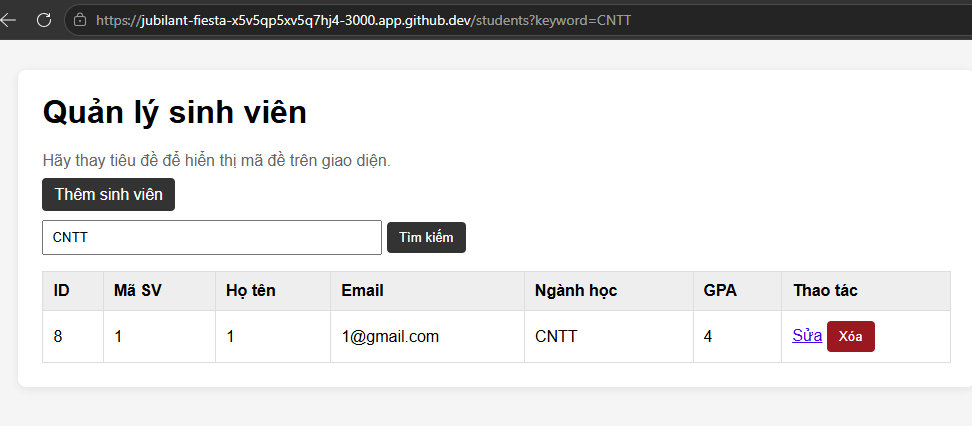

### **4. Lỗi 4: Chức năng sửa và xóa không làm thay đổi dữ liệu trong CSDL**
- **Nguyên nhân**: Hàm `updateStudent` và `deleteStudent` trong **models/studentModel.js** mới chỉ viết giả lập (`resolve(0)`) mà chưa tương tác với cơ sở dữ liệu.
- **Cách sửa**: Bổ sung truy vấn SQL `UPDATE` và `DELETE` thực tế xuống SQLite:
  - Hàm `updateStudent`: Chạy lệnh `UPDATE students SET student_code = ?, fullname = ?, email = ?, major = ?, gpa = ? WHERE id = ?`.
  - Hàm `deleteStudent`: Chạy lệnh `DELETE FROM students WHERE id = ?`.
- **Minh chứng vị trí code cần sửa**:
  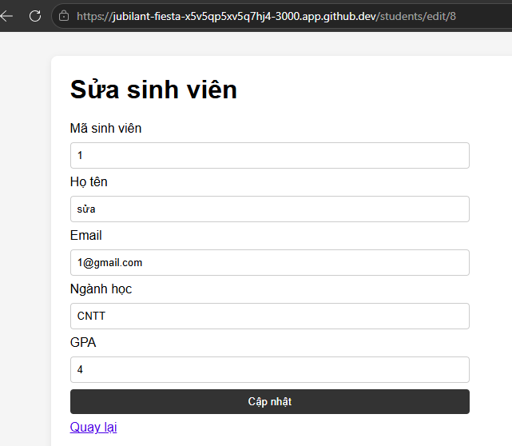
  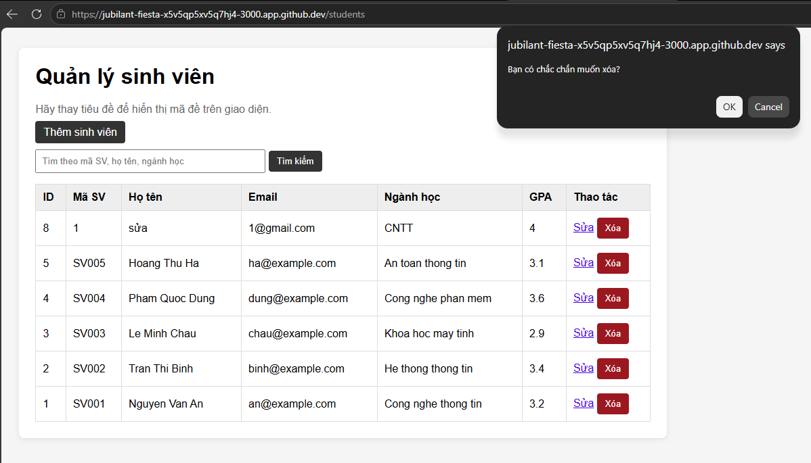

---

## PHẦN 3. BỔ SUNG CHỨC NĂNG TÌM KIẾM

### **Hoàn thiện tìm kiếm theo mã SV, họ tên, ngành học**

- **Model (models/studentModel.js)**:
  ```javascript
  function searchStudents(keyword) {
    return new Promise((resolve, reject) => {
      const searchPattern = `%${keyword}%`
      const sql = `SELECT * FROM students WHERE student_code LIKE ? OR fullname LIKE ? OR major LIKE ? ORDER BY id DESC`
      db.all(sql, [searchPattern, searchPattern, searchPattern], (error, rows) => {
        if (error) reject(error)
        else resolve(rows)
      })
    })
  }
  ```
- **Controller (controllers/studentController.js)**: Lấy `keyword = req.query.keyword || ""`, nếu có thì gọi hàm search của Model. Khi render truyền `keyword` và `message` (nếu mảng kết quả trống thì `message = "Không tìm thấy sinh viên phù hợp"`).
- **View (views/students/index.ejs)**: Gán thuộc tính `value="<%= keyword %>"` cho ô tìm kiếm và in thông báo lỗi nếu có `message`.
- **Minh chứng kết quả**:
  * **OLD** (hiển thị toàn bộ sinh viên):
    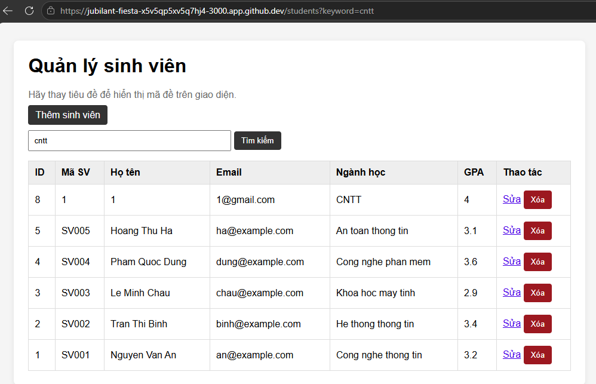
  * **NEW** (lọc chính xác kết quả):
    

---

## PHẦN 4. HOÀN THIỆN CHỨC NĂNG SỬA SINH VIÊN

### **Hoàn thiện chức năng sửa**

- **Route (routes/studentRoutes.js)**:
  ```javascript
  router.get("/edit/:id", studentController.editForm)
  router.post("/edit/:id", studentController.update)
  ```
- **Model (models/studentModel.js)**:
  ```javascript
  function updateStudent(id, student) {
    return new Promise((resolve, reject) => {
      const sql = `UPDATE students SET student_code = ?, fullname = ?, email = ?, major = ?, gpa = ? WHERE id = ?`
      db.run(sql, [student.student_code, student.fullname, student.email, student.major, student.gpa, id], function (error) {
        if (error) reject(error)
        else resolve(this.changes)
      })
    })
  }
  ```
- **Controller & View**: Hàm `editForm` lấy thông tin cũ từ database truyền sang view để điền sẵn vào form bằng thuộc tính `value="<%= student.field %>"`. Hàm `update` lấy thông tin mới từ `req.body`, gọi model cập nhật và thực hiện `res.redirect("/students")`.
- **Minh chứng kết quả**:
  * **OLD CODE**:
    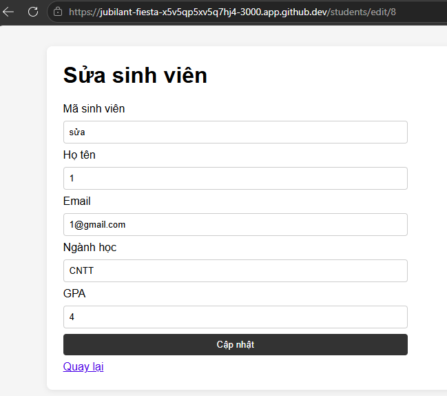
    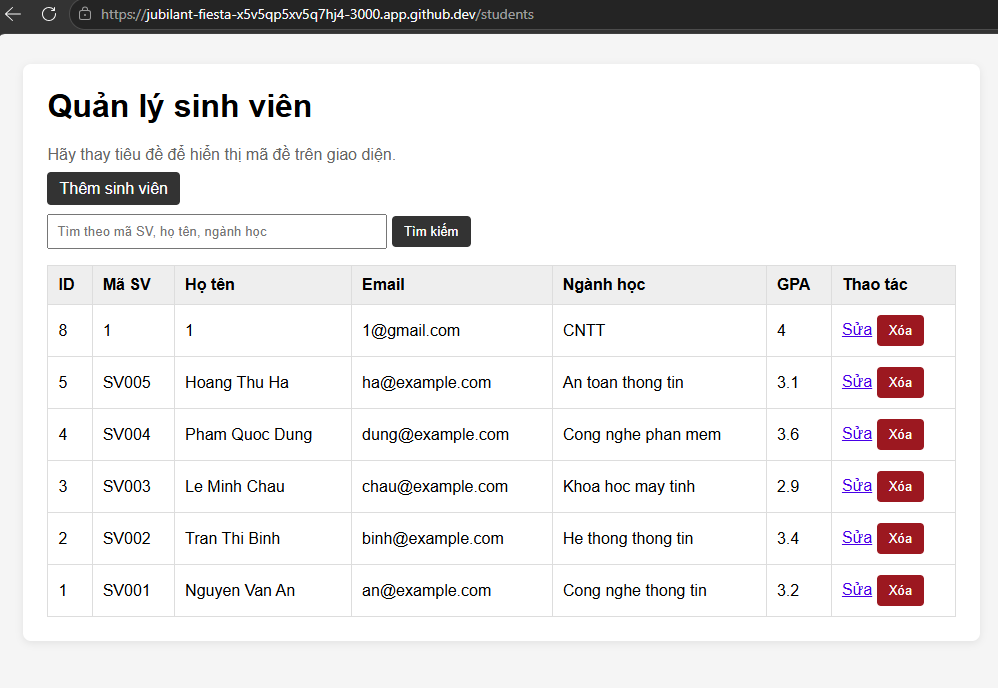
---
  * **NEW CODE**:
    
    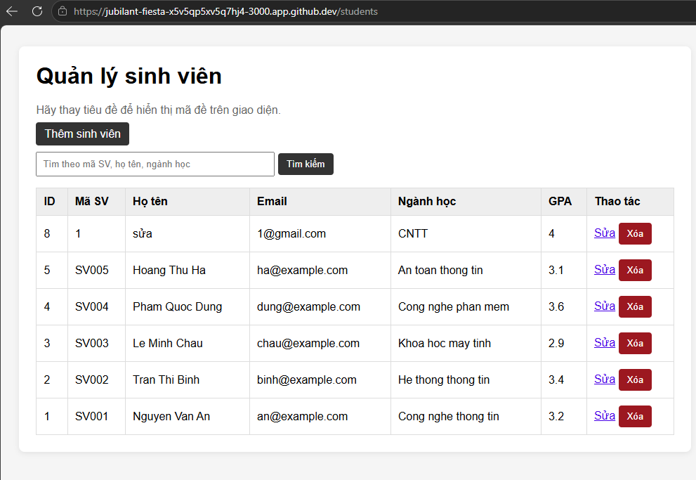

---

## PHẦN 5. HOÀN THIỆN CHỨC NĂNG XÓA SINH VIÊN

### **Hoàn thiện chức năng xóa**

- **Route (routes/studentRoutes.js)**: Sử dụng phương thức POST để đảm bảo an toàn.
  ```javascript
  router.post("/delete/:id", studentController.destroy)
  ```
- **Model (models/studentModel.js)**:
  ```javascript
  function deleteStudent(id) {
    return new Promise((resolve, reject) => {
      const sql = "DELETE FROM students WHERE id = ?"
      db.run(sql, [id], function (error) {
        if (error) reject(error)
        else resolve(this.changes)
      })
    })
  }
  ```
- **View (views/students/index.ejs)**: Gói nút xóa trong một thẻ `<form>` POST:
  ```html
  <form method="POST" action="/students/delete/<%= student.id %>" class="inline-form">
    <button type="submit" onclick="return confirm('Bạn có chắc chắn muốn xóa?')">Xóa</button>
  </form>
  ```
- **Minh chứng kết quả**:
  * **Khi xóa**:
    
  * **Danh sách sinh viên sau khi thực hiện xóa**:
    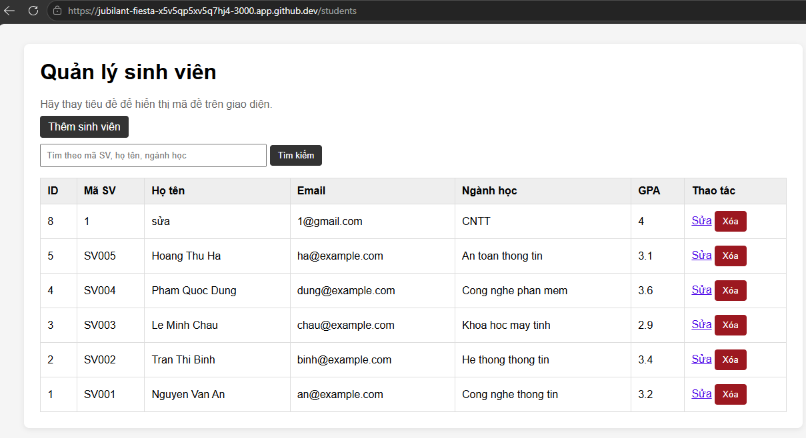
  * **Danh sách sinh viên sau khi đã thực hiện xóa**:
    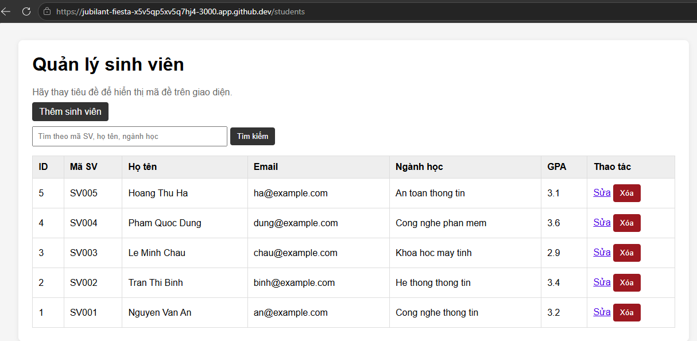

---

## PHẦN 6. ĐỌC HIỂU CODE VÀ GIẢI THÍCH

- **Câu 1**: `:id` là tham số động (route parameter) trên URL đại diện cho ID của sinh viên được chọn. Nó giúp dùng chung một định tuyến cho nhiều bản ghi khác nhau.
- **Câu 2**: Giá trị `req.params.id` trích xuất từ URL gửi lên của request, tương ứng với vị trí của tham số `:id` được cấu hình trên route.
- **Câu 3**: Dùng `req.body.id` sẽ khiến ID bị `undefined` (do ID nằm trên URL chứ không đính kèm trong thân request), từ đó Model nhận ID rỗng và câu lệnh xóa SQLite sẽ không thành công.
- **Câu 4**: Nên dùng POST thay vì GET vì:
  1. GET chỉ dành cho đọc dữ liệu (safe & idempotent) theo chuẩn RESTful.
  2. Tránh rủi ro bị các công cụ prefetch trình duyệt, bots hoặc click nhầm trong lịch sử duyệt web tự động kích hoạt đường dẫn GET xóa dữ liệu ngoài ý muốn.
- **Câu 5**: Nếu bỏ `res.redirect("/students")`, trình duyệt người dùng sẽ bị treo (loading) vô hạn tới khi timeout vì không nhận được phản hồi kết thúc request, đồng thời tăng rủi ro gửi trùng request xóa khi bấm F5 tải lại trang.
